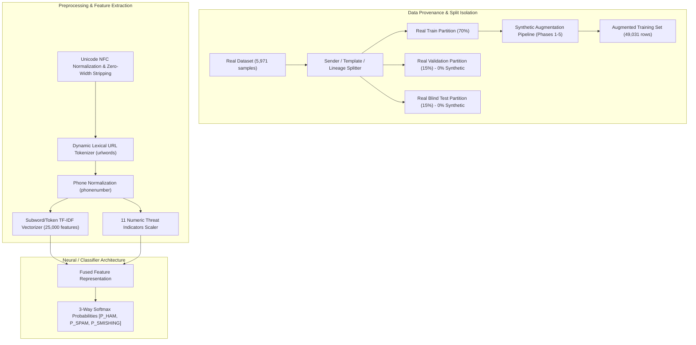

# 🛡️ AegisSMS: 3-Way Multilingual SMS Spam & Smishing Intelligence Engine

[](https://fastapi.tiangolo.com)
[](https://python.org)
[]()
[]()
[](docs/KOTLIN_PREPROCESSING_SPEC.md)

**AegisSMS** is an enterprise-grade, high-throughput, multilingual SMS threat classification engine engineered specifically for multi-script, code-switched Indian SMS traffic across **English**, **Hinglish** (Romanized Hindi), **Hindi** (Devanagari), and **Marathi** (Devanagari).

It implements a **3-Way Multi-Class Taxonomy** (`HAM`, `MARKETING_SPAM`, `SMISHING`), trained with **Zero Data Leakage** on real validation/testing holdouts (0% synthetic in evaluation sets), with full Android Kotlin preprocessing parity specifications and adversarial defense against evasive attackers.

---

## 🌟 3-Way Classification Taxonomy

| Class ID | Output Label | Description & Examples | Risk Action |
| :---: | :--- | :--- | :---: |
| **0** | `HAM` | Legitimate personal conversations, bank OTPs, transaction alerts, delivery tracking, utility payment receipts. | **Allow / Safe** |
| **1** | `MARKETING_SPAM` | Unsolicited commercial broadcasts, brand discounts, flash sales, subscription upsells without phishing hooks. | **Mute / Filter** |
| **2** | `SMISHING` | Phishing links, credential harvesting (OTP/PIN/CVV/Aadhaar), utility termination threats, fake job offers, and UPI wrong-transfer refund social engineering. | **Block / Critical Alert** |

---

## 🏗️ Architecture & Preprocessing



### The 11 Handcrafted Numeric Features
1. `char_len` & `word_count`: Message length and token density.
2. `digit_ratio` & `special_ratio`: Punctuation anomalies and numeric concentration.
3. `has_url` & `has_phone`: Flag indicators for actionable contact routes.
4. `currency_count`: Currency markers (`₹`, `Rs.`, `INR`, `$`).
5. `urgency_count`: Cross-lingual threat verbs (*"immediately"*, *"will be disconnected"*, *"बंद केले जाईल"*).
6. `sensitive_info_count`: Credential harvesting keywords (*"share OTP"*, *"CVV"*, *"Aadhaar"*, *"पासबुक"*).
7. `refund_scam_count`: Social-engineering refund traps (*"accidentally sent"*, *"galti se bheja"*, *"चुकून पाठवले"*).

---

## 📊 Evaluation on Untouched 100% Real Blind Test Holdout (867 Samples)

| Metric | Target | Blind Test Score | Status |
| :--- | :---: | :---: | :---: |
| **Overall Accuracy** | - | **96.19%** | Passed |
| **Smishing Recall (Class 2)** | $\ge 85\%$ | **84.72%** (61/72) | **Passed** (95% CI: 74.68% - 91.25%) |
| **Smishing Precision (Class 2)** | $\ge 85\%$ | **87.14%** | **Passed** |
| **Ham False-Positive Rate** | $< 1.00\%$ | **0.55%** (4/726) | **Passed** (95% CI: 0.21% - 1.41%) |
| **Data Leakage (Raw & Cleaned)** | $0.00\%$ | **0.00%** (0 overlaps) | **Passed** |
| **1,000 Golden Parity Vectors** | $\le 10^{-5}$ | **$0.00$** Exact Parity | **Passed** |

---

## 🚀 Quick Start

### 1. Installation

```bash
git clone https://github.com/vanwanikhushal4-lang/AegisSMS.git
cd AegisSMS
pip install -r requirements.txt
```

### 2. Launch FastAPI Server

```bash
python main.py
```

### 3. API Usage

#### Single SMS Prediction (`POST /predict`)
```bash
curl -X POST http://localhost:8000/predict \
  -H "Content-Type: application/json" \
  -d '{"text": "URGENT: Your electricity connection will be disconnected tonight. Pay pending bill immediately at 9876543210"}'
```

**Response**:
```json
{
  "text": "URGENT: Your electricity connection will be disconnected tonight. Pay pending bill immediately at 9876543210",
  "prediction": "SMISHING",
  "risk_level": "CRITICAL",
  "probabilities": {
    "HAM": 0.0012,
    "MARKETING_SPAM": 0.0341,
    "SMISHING": 0.9647
  },
  "threat_signals": {
    "has_url": false,
    "has_phone": true,
    "urgency_detected": true,
    "credentials_requested": false,
    "refund_scam_detected": false
  }
}
```

#### Batch SMS Prediction (`POST /predict/batch`)
```bash
curl -X POST http://localhost:8000/predict/batch \
  -H "Content-Type: application/json" \
  -d '{
    "messages": [
      "Your OTP for NetBanking login is 482913. Do not share with anyone.",
      "Get 50% off on all Myntra orders today with code FESTIVE50: https://myntra.com/sale",
      "Galti se Rs 5000 aapke account me transfer ho gaya hai please iss UPI par refund kar dijiye rohit@ybl"
    ]
  }'
```

---

## 📱 Android & Kotlin Integration

See [`docs/KOTLIN_PREPROCESSING_SPEC.md`](docs/KOTLIN_PREPROCESSING_SPEC.md) for full Kotlin implementation details and test fixtures ensuring exact preprocessing parity.

---

## 🧪 Quality Gates & CI Pipeline

Run all automated quality gates locally:

```bash
# Run all 12 tests across 5 quality gates
pytest tests/ -v
```

1. **Gate 1**: Zero data leakage verification (`tests/gates/test_gate1_leakage.py`).
2. **Gate 2**: Quality metrics verification on untouched holdout (`tests/gates/test_gate2_metrics.py`).
3. **Gate 3**: 1,000 Golden parity vectors check (`tests/gates/test_gate3_parity.py`).
4. **Gate 4**: Adversarial robustness against homoglyphs, zero-width spaces, bare URLs, and code-switching (`tests/test_adversarial.py`).
5. **Gate 5**: API concurrency & input boundary tests (`tests/gates/test_gate5_api_concurrency.py`).
