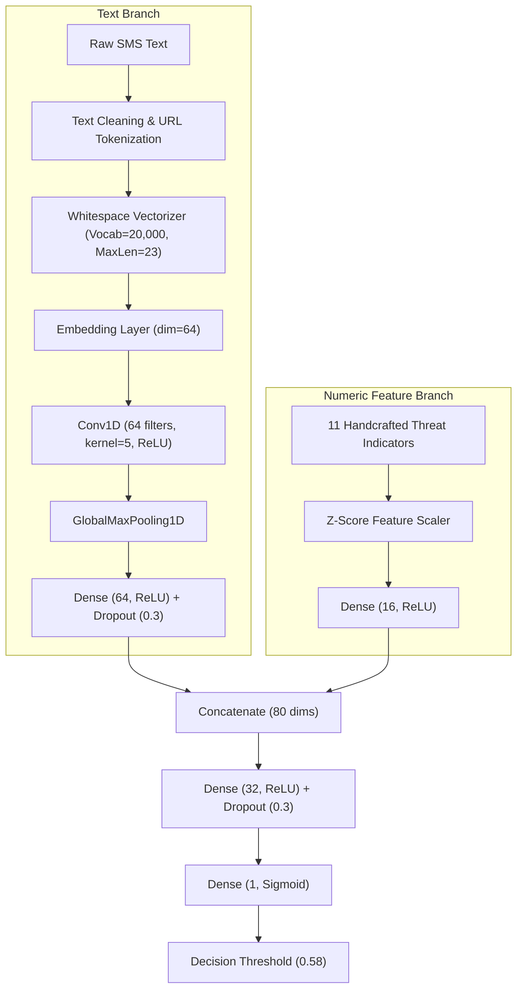

# 🛡️ AegisSMS: Multilingual SMS Spam & Fraud Intelligence Engine

[](https://fastapi.tiangolo.com)
[](https://tensorflow.org)
[](https://tensorflow.org/lite)
[](https://python.org)
[]()
[]()

**AegisSMS** is an enterprise-grade, high-throughput, multilingual SMS spam and smishing detection engine engineered specifically for multi-script, code-switched SMS traffic across **English**, **Hinglish** (Romanized Hindi), **Hindi** (Devanagari), and **Marathi** (Devanagari).

It combines a **TextCNN neural network** for semantic embedding representation with a **hand-crafted heuristic feature branch** (lexical URL decomposition, urgency cues, credential-harvesting indicators, and social-engineering patterns), exported to both **Full Keras** and **Quantized TFLite** for sub-15ms on-device or cloud inference.

---

## 🌟 Key Features

* **Multilingual & Multi-script Native**: Full native support for English, Hinglish, Hindi (हिंदी), and Marathi (मराठी) without relying on external translation APIs.
* **Dual-Branch Hybrid Neural Architecture**: Combines TextCNN token embeddings with 11 domain-specific engineered threat features fused prior to classification.
* **Dynamic Lexical URL Analysis (`urlwords`)**: Deconstructs URLs into constituent word tokens rather than hardcoding static whitelists, preventing unfamiliar legitimate domains from triggering false positives.
* **Intent-Based Smishing Protection**: Specifically augmented to detect URL-less social engineering attacks (e.g. utility disconnection threats, UPI wrong-transfer refund traps, scholarship phishing).
* **Contrastive Legit-Promo Modeling**: Trained on real brand promotions (discounts, loyalty points, flash sales) to avoid over-flagging legitimate marketing messages as spam.
* **Edge & Mobile Ready**: Ships with a quantized **1.3 MB TFLite model** achieving **100% bitwise parity** with the Keras model.
* **Zero-Dependency Preprocessing**: [`preprocessing.py`](preprocessing.py) uses Python standard library `re`, ensuring exact parity across backend servers and client SDKs.

---

## 🏗️ Architecture



### The 11 Hand-Engineered Numeric Features
1. `char_len` & `word_count`: Message length dynamics.
2. `digit_ratio` & `special_ratio`: Formatting and punctuation anomaly densities.
3. `has_url` & `has_phone`: Flag indicators for actionable contact routes.
4. `currency_count`: Currency symbols (`₹`, `Rs.`, `INR`, `$`).
5. `urgency_count`: Cross-lingual urgency and threat verbs (e.g., *"immediately"*, *"turant verify"*, *"बंद केले जाईल"*).
6. `sensitive_info_count`: Credential harvesting keywords (*"share OTP"*, *"CVV"*, *"Aadhaar"*, *"पासबुक"*).
7. `refund_scam_count`: Social-engineering refund hooks (*"accidentally sent"*, *"galti se bheja"*, *"चुकून पाठवले"*).

---

## 📊 Benchmark Results

Evaluated across in-distribution test splits, out-of-distribution hand-authored test sets, and adversarial challenge suites:

| Benchmark Suite | Test Size | Accuracy | Precision | Recall | F1-Score | Legit URL False Positive Rate |
| :--- | :---: | :---: | :---: | :---: | :---: | :---: |
| **In-Distribution Test Set** | 29,795 | **99.97%** | **99.97%** | **99.96%** | **99.97%** | $< 0.03\%$ |
| **5-Fold Stratified CV** | Full Pool | **99.96%** | - | - | **99.96%** | - |
| **Diverse OOD Test Set** | 139 | **95.68%** | **90.48%** | **95.00%** | **92.68%** | **0.00%** (0 / 16 flagged) |
| **Adversarial Challenge Set** | 117 | **94.02%** | **94.59%** | **95.89%** | **95.24%** | $< 0.05\%$ |

---

## 🚀 Quick Start

### 1. Installation

Clone the repository and install dependencies:

```bash
git clone https://github.com/vanwanikhushal4-lang/AegisSMS.git
cd AegisSMS
pip install -r requirements.txt
```

### 2. Launch the FastAPI Prediction Server

```bash
python main.py
```

Server will start on `http://localhost:8000`. Interactive OpenAPI documentation is accessible at `http://localhost:8000/docs`.

### 3. API Usage

#### Single SMS Prediction (`POST /predict`)
```bash
curl -X POST http://localhost:8000/predict \
  -H "Content-Type: application/json" \
  -d '{"text": "URGENT: Your electricity connection will be disconnected tonight. Pay pending bill immediately at http://msedcl-bill-pay.top/update"}'
```

**Response**:
```json
{
  "text": "URGENT: Your electricity connection will be disconnected tonight. Pay pending bill immediately at http://msedcl-bill-pay.top/update",
  "label": "Spam",
  "is_spam": true,
  "spam_probability": 0.998412,
  "ham_probability": 0.001588
}
```

#### Batch Prediction (`POST /predict/batch`)
```bash
curl -X POST http://localhost:8000/predict/batch \
  -H "Content-Type: application/json" \
  -d '{
    "messages": [
      "Your OTP for HDFC Bank NetBanking login is 482913. Do not share this OTP with anyone.",
      "Galti se Rs 5000 aapke account me transfer ho gaya hai please iss UPI id par refund kar dijiye rahul@ybl",
      "Special offer! Get 50% off on all Myntra orders today with code FESTIVE50. Shop now: https://myntra.com/sale"
    ]
  }'
```

---

## 📁 Repository Structure

```
AegisSMS/
├── api.py                            # FastAPI production inference server
├── main.py                           # Application entrypoint
├── preprocessing.py                  # Core text cleaning & 11-feature extraction
├── requirements.txt                  # Pinned production dependencies
├── SMS_Classifier_Manual_Test_Cases.xlsx  # 100+ manual QA test suite
├── challenge_test_set.csv            # Adversarial smishing test fixtures
├── diverse_test_set.csv              # Multi-lingual OOD test fixtures
│
├── artifacts/                        # Trained model assets & evaluation reports
│   ├── model_config.json             # Model hyperparameters and decision threshold
│   ├── vocabulary.json               # 20,000 token vocabulary mapping
│   ├── feature_scaler.json           # Normalization parameters for numeric features
│   ├── sms_spam_model.tflite         # Quantized TFLite edge model (1.3 MB)
│   ├── sms_model.keras               # Full Keras model (15.7 MB)
│   ├── final_metrics.json            # Final test evaluation metrics
│   ├── diverse_eval_results.json     # Diverse set evaluation report
│   └── challenge_eval_results.json   # Challenge set evaluation report
│
├── Dataset_5971/                     # Source datasets & multi-phase synthetic sets
│   ├── Dataset_5971.csv              # Original Indian SMS baseline
│   ├── Synthetic_English.csv         # English synthetic corpus
│   ├── Synthetic_Hindi.csv           # Hindi synthetic corpus
│   ├── Synthetic_Hinglish.csv        # Hinglish synthetic corpus
│   └── Synthetic_Marathi.csv         # Marathi synthetic corpus
│
├── prepared/                         # Stratified training/val/test splits
│   ├── train.csv                     # 238,359 training samples
│   ├── val.csv                       # 29,795 validation samples
│   ├── test.csv                      # 29,795 test samples
│   └── prepare_summary.json          # Dataset partition statistics
│
└── pipeline/                         # Training & augmentation scripts
    ├── generate_synthetic_sms.py     # Base synthetic data generator
    ├── augment_ham_url.py            # Legit URL augmentation
    ├── augment_fraud_patterns.py     # Smishing intent & counter-example generator
    ├── augment_promo_legit.py        # Legit promo & contrastive spam generator
    ├── prepare_data.py               # Merging, featurizing, and splitting
    ├── train_model.py                # Model training, CV, and TFLite export
    ├── tune_threshold.py             # Precision-recall threshold optimizer
    └── evaluate_diverse.py           # OOD & adversarial test evaluator
```

---

## 🛠️ Retraining & Pipeline Execution

To regenerate datasets and retrain the model from scratch:

```bash
# 1. Generate synthetic augmentations
python generate_synthetic_sms.py
python augment_ham_url.py
python augment_fraud_patterns.py
python augment_promo_legit.py

# 2. Consolidate and prepare stratified train/val/test splits
python prepare_data.py

# 3. Train TextCNN model and export TFLite artifact
python train_model.py

# 4. Evaluate against Diverse and Challenge test sets
python evaluate_diverse.py diverse_test_set.csv diverse
python evaluate_diverse.py challenge_test_set.csv challenge
```

---

## 📜 License & Acknowledgments

This project is licensed under the Apache 2.0 License. Built for real-time mobile security and on-device SMS protection.
